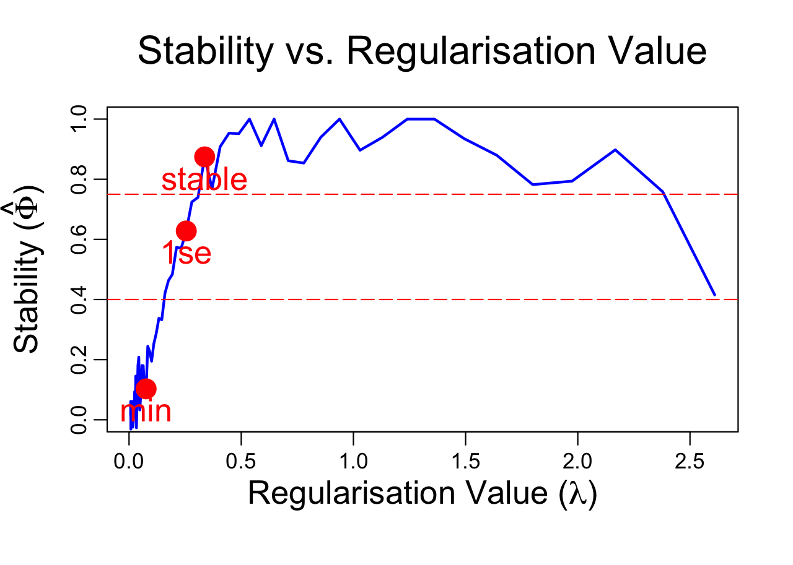

# stabplot

`stabplot` is an R package designed to facilitate regularization tuning and convergence monitoring in stability selection using LASSO. It provides two core functions, `Regustab` and `Convstab`, which help visualize stability in regularized models, supporting users in selecting appropriate regularization parameters and assessing convergence.

## Installation

You can install the latest version of `stabplot` from GitHub:

```r
# install.packages("devtools")  # Uncomment if you haven't installed devtools
devtools::install_github("MahdiNouraie/stabplot")
#loading the installed libarary
library(stabplot) 
```
`Regustab` function creates a plot that displays stability values in relation to regularization values for LASSO through stability selection. The plot highlights key lambda values, including `lambda.min`, `lambda.1se`, and `lambda.stable`. If `lambda.stable` is not available, the function will display `lambda.stable.1sd` 
A toy example of usage:
```r
instead.set.seed(123)
x <- matrix(rnorm(1000), ncol = 10)
# create beta based on the first 3 columns of x and some error
beta <- c(1, 2, 3, rep(0, 7))
y <- x %*% beta + rnorm(100)
B <- 10
Regustab(x, y, B)
```


`Convstab` creates a plot displaying stability values along with confidence intervals, bagainst the sequential sub-sampling index within stability selection. This plot aids in monitoring the convergence status of stability values. The function uses `lambda.stable` to generate the plot; if `lambda.stable` is unavailable, it defaults to `lambda.stable.1sd`.
A toy esample odf usage:
```r
set.seed(123)
x <- matrix(rnorm(1000), ncol = 10)
# create beta based on the first 3 columns of x and some error
beta <- c(5, 4, 3, rep(0, 7))
y <- x %*% beta + rnorm(100)
B <- 200
Convstab(x, y, B)
```


