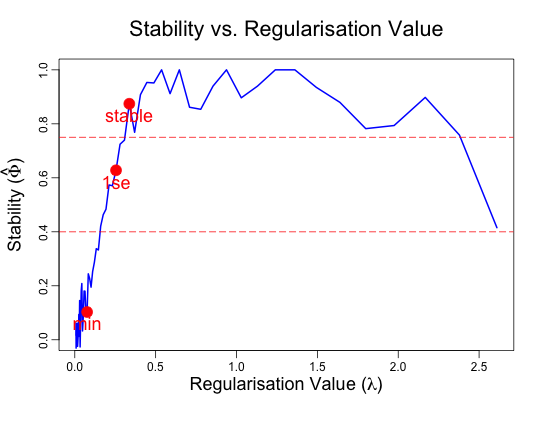
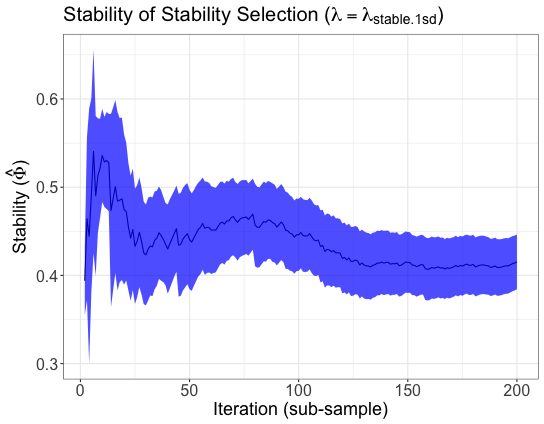

stabplot
================


`stabplot` is an R package designed to facilitate regularisation tuning and convergence monitoring in stability selection using Lasso. It provides two core functions, `Regustab` and `Convstab`, which help visualise stability in regularised models, supporting users in selecting appropriate regularisation parameters and assessing convergence.
Help functions are available through R by `?stabplot`, `?Regustab`, and `?Convstab`. 

The methodology is based on the paper:

**"Stability-guided hyper-parameter tuning for stability selection" (2026) Nouraie, Mahdi, and Samuel Muller, Communications in Statistics-Theory and Methods.**


## Installation

You can install and load the `stabplot` package using the following commands
in R:

```r
# Install the stabplot package from CRAN
install.packages("stabplot")

# Or install the stabplot package from GitHub

# Install 'devtools' if not already installed

if (!require("devtools")){install.packages("devtools")} 

devtools::install_github("MahdiNouraie/stabplot") #installing stabplot
library(stabplot) #loading stabplot
```

## Regustab

`Regustab` function creates a plot that displays stability values in relation to regularisation values for Lasso through stability selection. The plot highlights key lambda values, including `lambda.min`, `lambda.1se`, and `lambda.stable`. If `lambda.stable` is not available, the function will display `lambda.stable.1sd`.

`Regustab` also returns a list containing the highlighted regularisation values — `min`, `1se`, and `stable` (or `stable.1sd`) — accessible via `res$min`, `` res$`1se` ``, and `res$stable`.

A toy example of usage:
```r
set.seed(123) # for reproducibility
x <- matrix(rnorm(1000), ncol = 10)
# create beta based on the first 3 columns of x and some error
beta <- c(1, 2, 3, rep(0, 7))
y <- x %*% beta + rnorm(100)
B <- 10 # number of sub-samples
res <- Regustab(x, y, B)
res
# $min
#[1] 0.07609021

#$`1se`
#[1] 0.2550241

#$stable
#[1] 0.3371269
```



## Convstab

`Convstab` creates a plot displaying stability values along with confidence intervals, against the sequential sub-sampling index within stability selection. This plot aids in monitoring the convergence status of stability values. The function uses `lambda.stable` to generate the plot; if `lambda.stable` is unavailable, it defaults to `lambda.stable.1sd`.

The function returns a list containing the plot (`res$plot`) and a data frame of variables whose selection frequencies exceed thr (`res$selected`), so both can be accessed or reused after the call.

A toy example of usage:
```r
set.seed(123) # for reproducibility
x <- matrix(rnorm(1000), ncol = 10)
# create beta based on the first 3 columns of x and some error
beta <- c(0.5, 0.4, 0.3, rep(0, 7))
y <- x %*% beta + rnorm(100)
B <- 200 #number of sub-samples
alpha <- 0.05 #significance level of confidence interval
thr <- 0.5 # threshold for filtering variables based on their selection frequencies
res <- Convstab(x, y, B, alpha, thr)
res$selected
#  Variable Selection_Frequency
#1       x1               0.970
#2       x2               0.895
```



## References

1. Nouraie, M., & Muller, S. (2026). Stability-guided hyper-parameter tuning for stability selection. Communications in Statistics - Theory and Methods, 1–19.
2. Meinshausen, N., & Bühlmann, P. (2010). Stability selection. Journal of the Royal Statistical Society Series B: Statistical Methodology, 72(4), 417-473.
3. Nogueira, S., Sechidis, K., & Brown, G. (2018). On the stability of feature selection algorithms. Journal of Machine Learning Research, 18(174), 1-54.
4. [GitHub repository of Nogueira et al (2018)](https://github.com/nogueirs/JMLR2018)
5. Tibshirani, R. (1996). Regression shrinkage and selection via the Lasso. Journal of the Royal Statistical Society Series B: Statistical Methodology, 58(1), 267-288.


